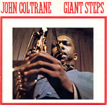
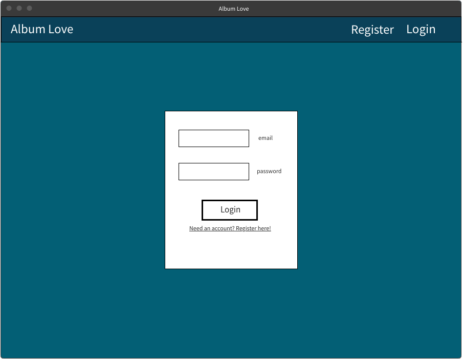
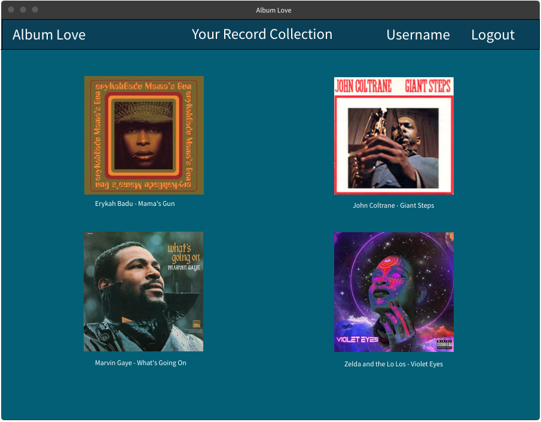
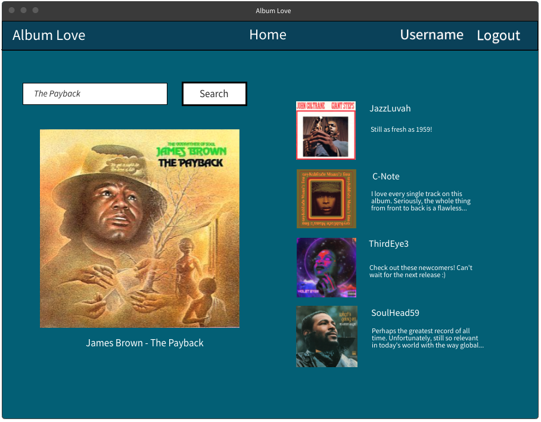
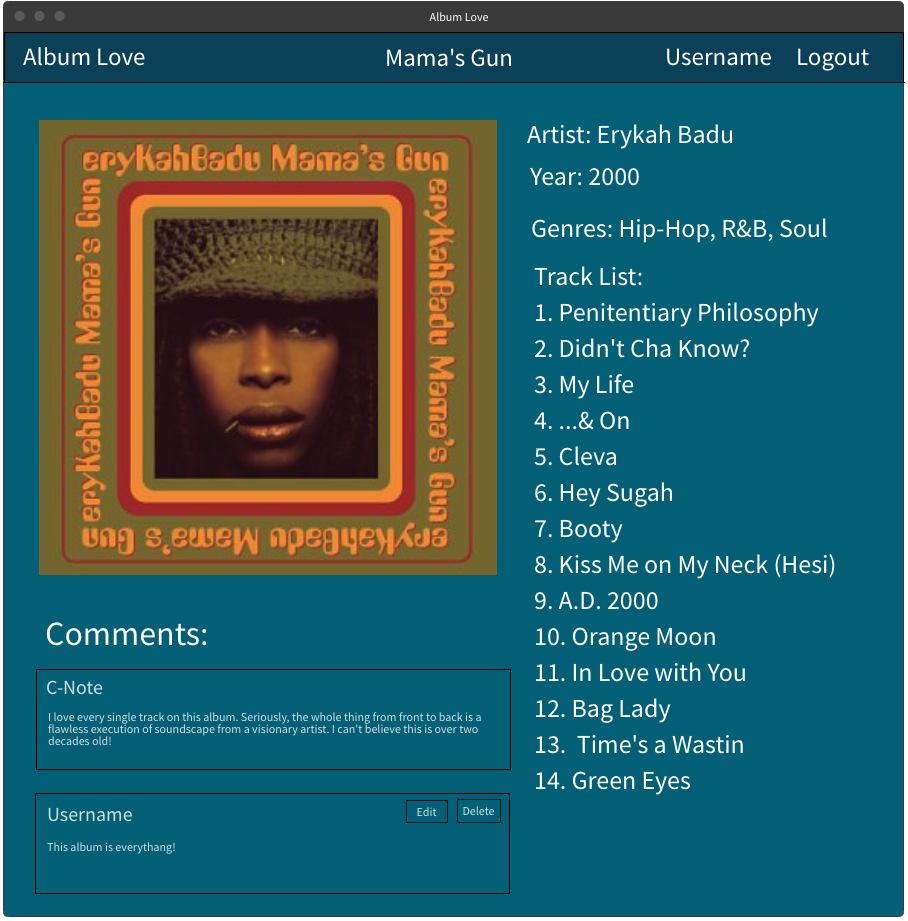
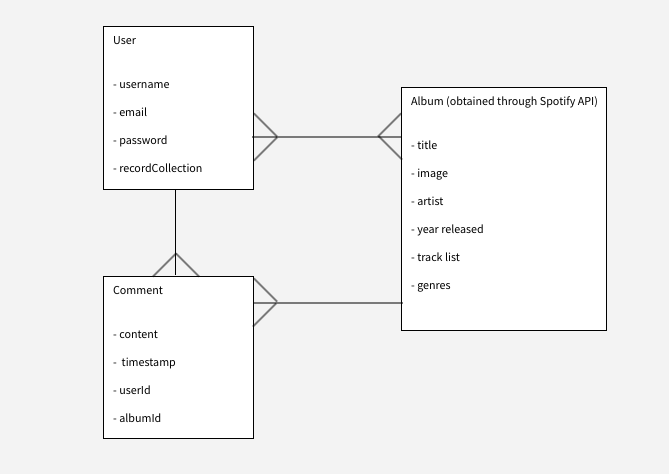

# AlbumLove

## Scope

Before the invention of the CD or cassette tape, people the world over bought vinyl albums and singles to listen to their favorite music.

A music lover would bring home their new music, pop it on to the record player and listen. As the various tunes played, one could hold the album artwork and get lost in a sea of visual and auditory art. 

Album Love is a social media website aimed at reuniting listeners with the pleasure of the album cover. It can be a companion to any listener that would like to see the cover as one would have in days past.

# 

### What can reasonably be finished

Users will be able to register an account, login/logout, and browse/search for their favorite albums (all sourced from the Spotify Web API) and add them to their "record collection." The record collection will be a public profile page that shows all albums added by the user. 

Each album will have it's own show page with a larger version of the cover alongside a basic set of information about the album.

Users will also be able to comment on particular album pages to join in on the discussion. All posts will feature the ability to be edited or deleted by the creating user.

Homepage will feature a search bar for albums and display the latest comments with most recent starting at the top. Each comment will feature a thumbnail of the album cover, the username, time posted, and up to 200 characters of the comment.

### Stretch Goals

Time permitting, I would like to:

1. Implement a likes system for both the records and comments
2. Suggest albums based on user's current record collection
3. Provide a featured album of the week on homepage
4. Create a homepage discussion thread where all users can comment on the topic

## User Stories

The user of Album Love is a music lover with either:

1. Nostalgic love for the era of spinning records
2. Lover of album art and images
3. Music lovers that aren't satisfied with the main formats for discussing music online

There are many bits of functionality that I would like to include for a smooth, responsive user experience. Below, I will describe the user flow for the minimum viable product.

### Arriving at page with no account

The user will navigate to the homepage first. A user will not require an account to search albums or look at the individual album pages, so they may choose to begin searching albums or reading comments and discussions on the individual album pages. 

To leave comments and save a "record collection," a user will have to register and log in to their account.

### Logging in and Homepage

Provided the user intends to create an account, they will follow the register link in the nav bar. Upon registering for an account, the user will be automatically logged in and redirected to the home page. The nav bar will feature buttons that will link to either the user's profile page, or to logout. 

On this homepage, users can search for albums in the search bar, and click on the individual albums to view the album show page. Conversely, they can look at the latest comments and click on one to travel to the parent album's show page.

### Album show page

Once on the album show page, a user can view some basic info on the album (artist, year released, genre, tracklist). In addition, the user can press the "add to collection" button that will add this album to their record collection on the profile page. Lastly, they can choose to leave comments on the albums or edit/delete previous comments they have left.

### Profile show page

If the user clicks on their own username in the nav bar, they will be taken to their profile page that displays their record collection. This will show all of the albums they have added, and each album will act as a link to the album's main show page. 

Stretch goals on this page include generating a list of comments that the user has left and the ability to view other user's record collections.

## Wireframes

This is the [Color Palette](https://coolors.co/d64236-e46947-e89c6e-e1c5a1-7b9d97-2c818c-1e6982-163251) I will use.

### Login Page

# 

### Profile Page

# 

### Home Page

# 

### Album Page

# 

## Data Models

Album Love will use two models for the database: User and Comment.

In addition, all album information will be sourced and rendered from the Spotify Web API.

While the API will not be a model in the Album Love database, it will still share a relationship with the User and Comment models, so it is included in this relationship chart.

# 

### User

The user model is plain and simple. We will have an email and password for authentication, a username for representation on the site, and a recordCollection attribute that will store an array of album id's for referencing in the Spotify database.

### Comments

Comments will feature attributes for content and a timestamp. These will populate the comment text and time of creation respectively on any pages that feature comments. In addition, comments will store a userId corresponding to the id of the creating user, and an albumId that will be used to reference the Spotify database.

### Albums

Since all of this information will be sourced from Spotify's API, we won't need a model for albums. We will be referencing specific data points that spotify tracks for all albums: title, image, artist, release date, track list, and genres. Each page will be dynamically populated using this data by referencing specific album id's.

# MVP

## Milestone 1 - completed by 9/9

- Github repo initialized, dependencies installed
- Basic server file configured
- Schema for models set up
- Controllers for individual routes to album show/index pages as well as user profile page
- Views established for aformentioned pages
- Partials set up for nav, footer, and tab
- Connection established between database and server
- Set up logic for Spotify Authorization, submitting queries through API, and adding information to context for ejs pages (see Feasibility Study)
- Basic styling for ejs pages for the purposes of testing and organization

## Milestone 2 - completed by 9/13

- Creating search bar that executes searches through Spotify API
- set up full authentication for Album Love users
- set up express-session
- set up controllers for comments
- add record collection functionality ('add to collection' button, logic behind adding a spotify album id to recordCollection array
- set database up online and connect to application

## Milestone 3 - completed by 9/16

- Finish styling and organizing elements of ejs pages for deployment
- Adjusting css/js for the purposes of responsiveness to user input
- Mobile responsiveness
- Refactor code for professional formatting and readability
- Deploy application

## Features that would be good to include, time permitting

- Adding likes to both comments and albums
- Provide a featured album randomly chosen from Spotify API each week

## Features for future iterations

- Providing suggested albums to users based on albums already present in record collection
- Add an independent discussion thread that users can comment on, present on the homepage